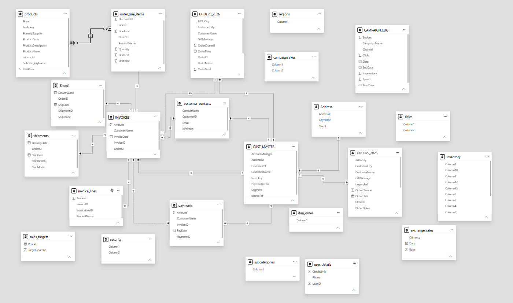
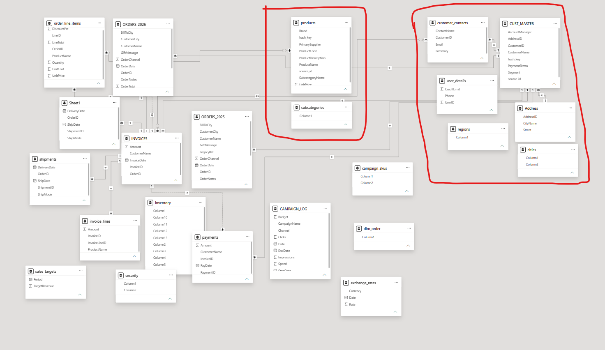
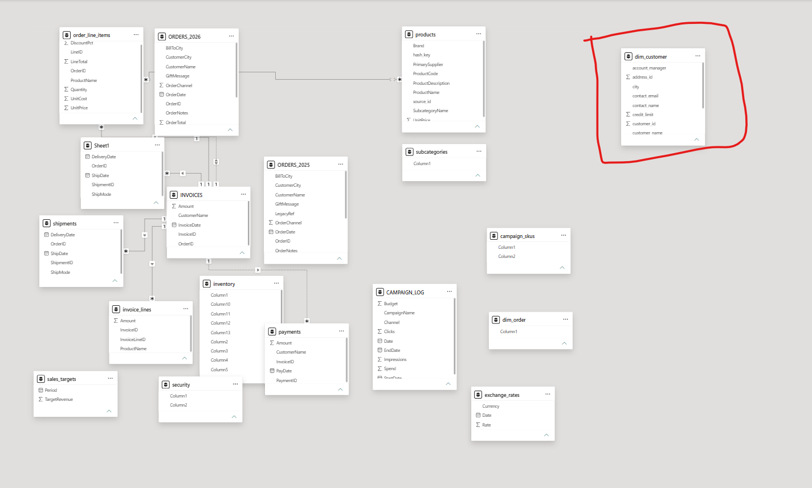
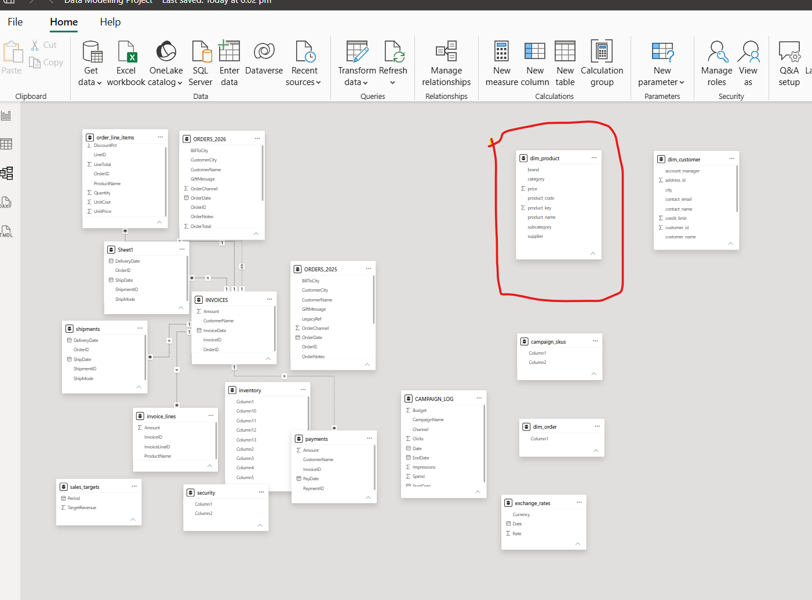
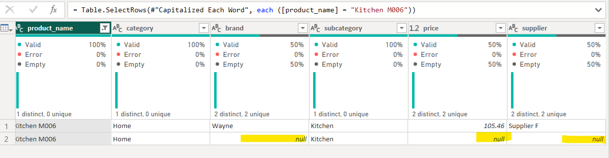
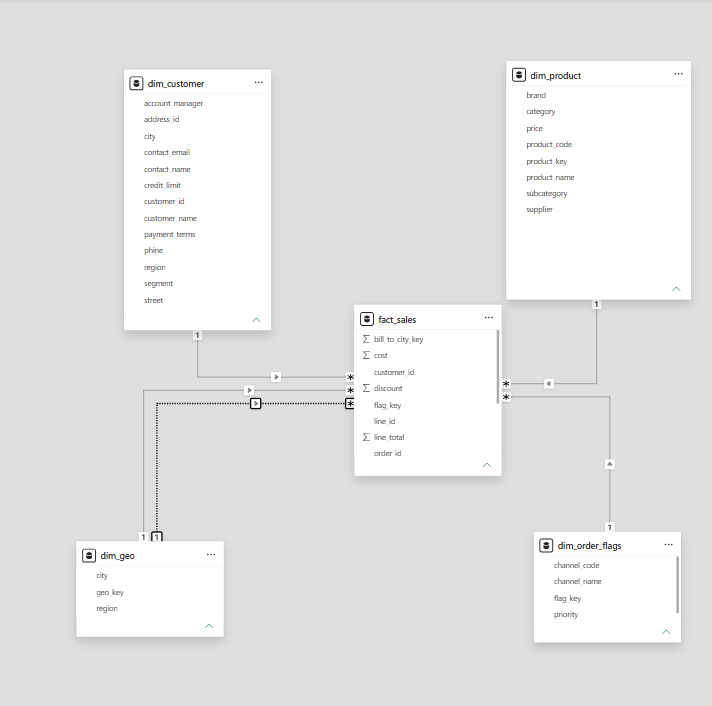
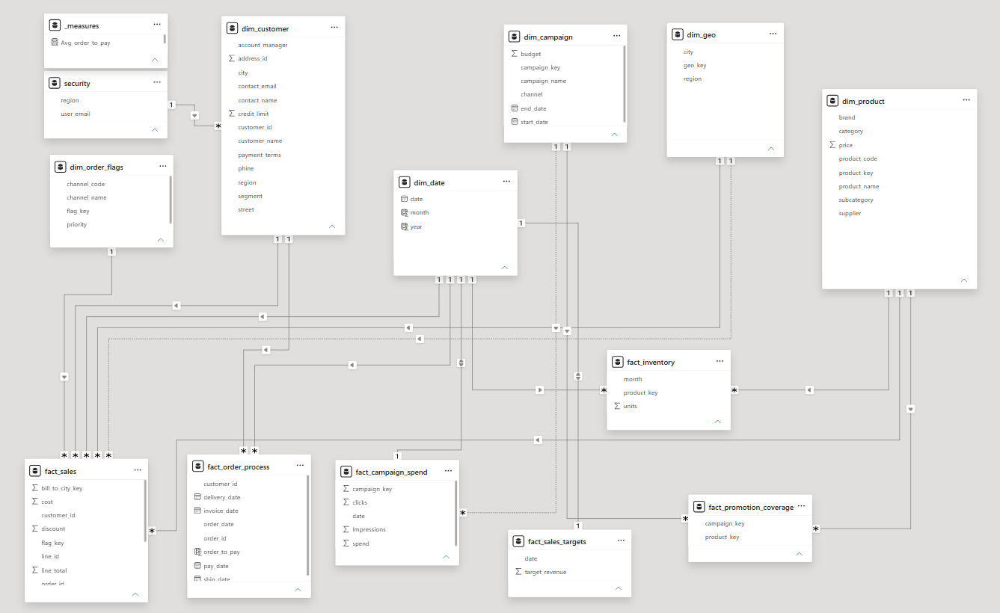
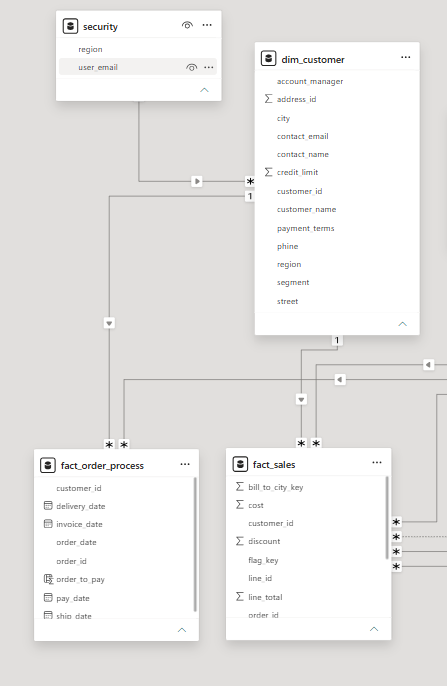
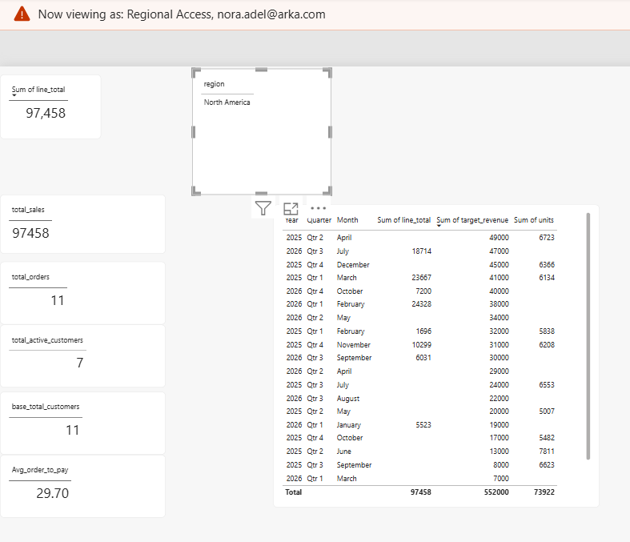

# Sales & Marketing Data Modelling — Star Schema Redesign in Power BI

Redesigned a fragmented, 23-table raw dataset into a governed **star schema** in Power BI — fixing broken keys, resolving data-quality issues, and enabling reliable, scalable reporting for the business.

Sales_Marketing_Data_Modelling_Project.docx - https://github.com/Shravan-SDVE/Sales_-_Marketing_Data_Modelling/tree/main/docs

## The Problem

The source data arrived as 23 loosely related tables with no defined facts or dimensions:

- Generic, meaningless column names (`Column1`, `Column2`) in several tables
- Duplicate fact tables (`ORDERS_2025` / `ORDERS_2026`) with near-identical structure
- Customer data fragmented across four disconnected tables with no shared key
- Text-based joins (`ProductName`, `CustomerName`) instead of IDs — slow and error-prone
- No date dimension, no row-level security, no star schema

The result: unreliable aggregations, slow queries, and a model that couldn't scale to new years, campaigns, or products.

*The raw dataset in Power BI — no facts/dimensions defined, many-to-many relationships, unlinked tables.*

## Approach

The redesign followed a structured four-phase methodology:

1. **Prepare & Explore** — reviewed all 23 tables column-by-column, understood the business context, and identified candidate facts and dimensions.
2. **Build Dimensions** — grouped related tables by entity and consolidated them into clean, standardised dimensions.
3. **Build Facts** — built fact tables at the correct grain, connected every dimension, and validated row counts after each merge.
4. **Polish** — standardised naming conventions, added a date dimension, built DAX measures, and applied row-level security.

*Related tables grouped and consolidated into `dim_customer` and `dim_product`.*

## Key Technical Decisions

- **Junk dimension** (`dim_order_flags`) — grouped low-cardinality, unrelated order attributes (channel, status, priority) that didn't warrant their own dimension tables.
- **Factless fact table** (`fact_promotion_coverage`) — modelled the many-to-many relationship between campaigns and products as a bridge table with no numeric measures.
- **Accumulating snapshot fact** (`fact_order_process`) — consolidated Order → Ship → Deliver → Invoice → Pay milestones into a single row per order.
- **Dual relationships to one dimension** — connected `dim_geo` to `fact_sales` twice (ship-to and bill-to city), with one relationship set inactive to avoid ambiguity.
- **Row-level security** — applied on `dim_customer`, propagating filters through to `fact_sales` and `fact_order_process` so each user sees only their relevant data.

*`dim_customer` after cleaning, merging, and de-duplication — down from four fragmented source tables.*

*`dim_product` with a surrogate key added via a custom index column, ready to connect to every fact table.*

## Solving a Real Data-Quality Bug

While merging `fact_sales` with `dim_product`, the line-item counts didn't reconcile after the merge — a red flag for a broken relationship. Investigation traced it to duplicate product records in the source system sharing the same name but different detail levels.

*Root-cause investigation: duplicate product records in `dim_product` causing key mismatches — a data-quality issue traced back to the source system.*

The fix: filter out the incomplete duplicate records at the source step, re-validate with a group-by check, and confirm the numbers reconciled — a validation habit repeated after every merge in the project.

## The Result: A Governed Star Schema

*One-to-many relationships from `fact_sales` to every dimension, using surrogate keys instead of text joins.*

*The completed model — every raw table consolidated into a governed set of fact and dimension tables.*

## Securing the Model

Row-level security was implemented on `dim_customer` and propagated across the connected fact tables, so different roles see only the data relevant to them.

*RLS rule applied on `dim_customer`.*

*Same report, viewed under a restricted regional role — totals automatically filter to the user's scope.*

## Business Outcomes

- **Accurate reporting** — surrogate-key joins removed the ambiguous aggregations caused by text-based matching.
- **Faster queries** — replacing text joins with integer keys across every fact-to-dimension relationship.
- **Scalable model** — new years, campaigns, and products extend existing tables instead of requiring new ones.
- **Governed access** — row-level security ensures each user sees only the data relevant to their role.

## Tools Used

`Power BI` · `Power Query (M)` · `DAX` · Star Schema Dimensional Modelling

---

*Full methodology, step-by-step build notes, and all 48 supporting screenshots are available in the [complete write-up](docs/Sales_Marketing_Data_Modelling_Project.docx).*
